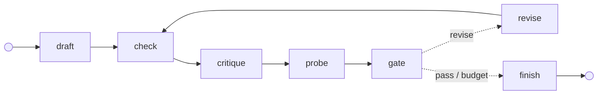

# 🔍 Critique Agents as a Graph — The Prompts, Node by Node

> **Level:** 🟡 Intermediate · **Reading time:** ~13 min · **Prerequisites:** [Graph Engineering](graph-engineering.md), [Building an Agent Evaluator](building-agent-evaluators.md) · **Companion code:** [my-agentic-moments › moment 01](https://github.com/gsaini/my-agentic-moments/tree/main/moments/01-critique-graph) (runs offline, no API key needed)

In a **critique loop**, one model call writes something, a second call reviews it, and the first revises it based on the review. The usual first try puts all of that into one prompt: *"Write the function, critique it yourself, and revise up to three times."* That gives one model four jobs: author, critic, judge, and stop rule. Nothing it says about its own work is ever checked.

This note builds the same loop as an **explicit graph** and gives the complete prompt set for it. The main idea:

> **Each model call gets its own short prompt. The loop, the routing, and the checking live in the graph, not in the prompts.**

The running example asks an agent to write `to_roman(n)`. The function is short enough to read in full, and it has two well-known traps: the subtractive forms (40 is `XL`, not `XXXX`) and invalid input.

## Table of contents

- [1. The graph](#1-the-graph)
- [2. The state: what flows along the edges](#2-the-state-what-flows-along-the-edges)
- [3. Who sees what](#3-who-sees-what)
- [4. The three prompts](#4-the-three-prompts)
- [5. The nodes with no prompt](#5-the-nodes-with-no-prompt)
- [6. One run, traced](#6-one-run-traced)
- [7. The wiring in code](#7-the-wiring-in-code)
- [8. Rules for prompting a critic](#8-rules-for-prompting-a-critic)
- [9. Beyond code: what a probe is elsewhere](#9-beyond-code-what-a-probe-is-elsewhere)
- [10. Anti-patterns](#10-anti-patterns)
- [11. Go deeper](#11-go-deeper)

---

## 1. The graph

Solid edges always fire. Dotted edges are the router's choices.



| Node | Model call? | Job |
| ---- | :-: | --- |
| `draft` | ✓ | Write the function from the spec and the visible tests. |
| `check` | | Run the visible tests, and re-run every earlier probe as a regression check. |
| `critique` | ✓ | Review the code. Return a verdict, evidence-backed issues, and probes. |
| `probe` | | Execute the critic's probes against the code. |
| `gate` | | **Critique the critique** (rules in [§5](#5-the-nodes-with-no-prompt)). |
| `revise` | ✓ | Rewrite the code from the gated issues. |
| router | | Go to `finish` on *pass* or when the round budget is spent. Otherwise go to `revise`. |

Three of the seven parts call a model. **All the parts that make decisions are code.** (The repo also has a `record` node between `probe` and `gate` that logs one line per round. This note leaves it out of the diagram because it doesn't affect any decision.)

## 2. The state: what flows along the edges

Nodes pass **artifacts** to each other, never chat transcripts. Here is the state right after round 1's `probe` step, abridged:

```json
{
  "task": { "function": "to_roman", "spec": "…1 to 3999… raise ValueError otherwise", "visible_tests": "…" },
  "code": "def to_roman(n): …  (a greedy table, missing 900/400/90/40)",
  "approach": "Greedy over a value table.",
  "checks": { "passed": 1, "failed": 0, "output": "" },
  "critique": {
    "verdict": "pass",
    "issues": [{ "severity": "minor", "problem": "Could be more Pythonic.", "evidence": "", "fix": "Refactor." }],
    "probes": [{ "call": "to_roman(40)", "expected": "'XL'" }, "…"]
  },
  "probes": [
    { "call": "to_roman(40)",   "expected": "'XL'",              "actual": "'XXXX'",          "passed": false },
    { "call": "to_roman(1994)", "expected": "'MCMXCIV'",         "actual": "'MDCCCCLXXXXIV'", "passed": false },
    { "call": "to_roman(0)",    "expected": "raises ValueError", "actual": "''",              "passed": false }
  ],
  "round": 1
}
```

The state is **immutable**. Each node returns only the fields it changes, and the runtime merges them and saves a **checkpoint** after every step. That lets you inspect a run step by step, replay it, or resume it from any point. See [Durable Execution](durable-execution.md).

## 3. Who sees what

Deciding what flows along each edge is most of the design work. Every model call is a **fresh, single-turn conversation**, so a prompt contains only what is listed here:

| Call | Sees | Never sees | Why |
| ---- | ---- | ---------- | --- |
| `draft` | spec, visible tests | hidden tests | The hidden tests are kept for grading only. |
| `critique` | spec, code, test results, probe results | the author's `approach`, any chat history | So it can't simply defer to the author's reasoning. |
| `revise` | spec, code, the *gated* issues, failures | the critic's original verdict, hidden tests | It acts on evidence, not on opinion. |

The `approach` field stays in the state so humans can read it in the trace. It is deliberately never passed to the critic.

---

## 4. The three prompts

These are a slightly sharper version of the prompts in the companion repo's [`nodes.py`](https://github.com/gsaini/my-agentic-moments/blob/main/moments/01-critique-graph/critique_graph/nodes.py). The graph, the gate, and the trace in this note match the repo exactly. Each call's output is enforced with **structured outputs**, meaning a schema the API validates, rather than "please reply in JSON".

### 4.1 `draft`: the author

**System prompt**

```text
You write small, correct Python functions from a specification.
Return the complete module, using only the standard library.
Handle every case the spec states, including invalid input.
```

**User prompt template**

```text
<spec>
{spec}
</spec>

<tests_that_must_pass>
{visible_tests}
</tests_that_must_pass>
```

**Output schema:** `{"approach": str, "code": str}`

### 4.2 `critique`: the critic

**System prompt**

```text
You review Python code that someone else wrote, against its specification.
You did not write it and owe it nothing.

Find real defects: wrong results, missed edge cases, crashes, spec violations.
Ignore style.

Every issue needs evidence: a failing test, a probe result, or a concrete input
and what the code returns for it. If you suspect a bug but can't show it,
write a probe for it instead of an issue.

Propose up to 6 probes: single calls with the exact result the spec requires,
aimed at the inputs most likely to break. They will be executed.

Say "pass" only if you would ship this code unchanged.
```

**User prompt template.** This is the round 2 version, filled in. In round 2 the critic sees the earlier probes re-run against the revised code:

```text
<spec>
Write `to_roman(n: int) -> str` that converts an integer from 1 to 3999 …
</spec>

<code>
{code}
</code>

<evidence>
Visible tests: 1 passed, 0 failed.
Probes from earlier rounds, re-run on this code:
- to_roman(40) → 'XL' (expected 'XL') ✓
- to_roman(1994) → 'MCMXCIV' (expected 'MCMXCIV') ✓
- to_roman(0) → raises ValueError (expected raises ValueError) ✓
</evidence>
```

**Output schema**

```json
{
  "verdict": "pass | revise",
  "issues": [{ "severity": "blocker | major | minor", "problem": "…", "evidence": "…", "fix": "…" }],
  "probes": [{ "call": "to_roman(40)", "expected": "'XL'" }]
}
```

**Why each line of the critic prompt is there**

| Line | Reason |
| ---- | ------ |
| *"someone else wrote … owe it nothing"* | LLM judges tend to favor work that resembles their own (*self-enhancement bias*). Framing the code as someone else's, together with real context isolation, works against that. |
| *"Ignore style"* | Style nits push real defects out of the review and trigger rewrites nobody needed. |
| *"Every issue needs evidence"* | It makes each issue checkable. The gate drops any issue that comes without evidence. |
| *"If you suspect a bug but can't show it, write a probe"* | It gives a suspicion somewhere to go, as an executable test instead of an argument. |
| *"up to 6 … the exact result the spec requires"* | The work stays bounded, and each expected value has to come from the spec rather than from the code. |
| *"pass only if you would ship this code unchanged"* | It sets a bar. "Looks fine" doesn't meet it. |

### 4.3 `revise`: the author again, with findings

**System prompt:** the same as `draft`.

**User prompt template**, filled with round 1's gated findings exactly as the gate writes them:

```text
<spec>
{spec}
</spec>

<current_code>
{code}
</current_code>

<findings>
- [blocker] to_roman(40) returns 'XXXX' (evidence: probe expected 'XL') → fix: Make the code return the expected value for this input.
- [blocker] to_roman(1994) returns 'MDCCCCLXXXXIV' (evidence: probe expected 'MCMXCIV') → fix: …
- [blocker] to_roman(0) returns '' (evidence: probe expected raises ValueError) → fix: …
</findings>

<failures>
{checks.output}
</failures>

Fix every finding without breaking what already works. Return the complete module.
```

The words *"without breaking what already works"* are only a request. What actually enforces it is `check`, which re-runs every earlier probe after each revision.

---

## 5. The nodes with no prompt

**`check`** runs the visible tests. Then it re-runs every probe from earlier rounds, so a fix can't silently undo an earlier one.

**`probe`** executes the critic's probes. A probe has to be one call to the task's function, and its expected value has to be a Python literal or `raises <ExceptionName>`. A probe that breaks these rules is recorded as invalid and never run. Execution happens in a subprocess with a timeout. That isolates crashes and hangs, but it is not a security sandbox.

**`gate`** critiques the critique, using rules instead of another opinion:

```python
def gate(s):
    kept = [i for i in s.critique.issues if i.evidence.strip()]           # 1. no evidence, no issue
    failing = [p for p in s.probes if p.valid and not p.passed]
    kept += [Issue("blocker", f"{p.call} returns {p.actual}",              # 2. a failing probe becomes a blocker
                   f"probe expected {p.expected}", "Make the code return the expected value for this input.")
             for p in failing]
    verdict = s.critique.verdict
    if not s.checks.ok or failing:                                        # 3. evidence beats verdicts
        verdict = "revise"
    elif verdict == "revise" and not kept:                                # 4. nothing to act on means done
        verdict = "pass"
    return {"critique": Critique(verdict=verdict, issues=kept)}
```

**The router** stops on *pass* or when the round budget is spent (4 drafts). Otherwise it sends the run back to `revise`. The runtime also has a hard step limit, so even a wiring bug can't loop forever.

**Why the gate is code and not a second LLM judge.** A judge of the judge has the same failure modes as the judge, and then you need a judge for that one too. Rules can be unit-tested, and the model can't argue its way past them. The limit is that code checks only what is checkable. The gate can see that an issue *has* evidence, but not that the evidence is *true*. That is why the strongest evidence is the kind the graph produces itself: test runs and probe results.

---

## 6. One run, traced

This is the output of `critique-graph demo` in the companion repo. It uses a **scripted model**, which shows the mechanics but measures nothing:

| Round | Step | What happened |
| :-: | ---- | ------------- |
| 1 | `draft` | Greedy table that has `IX` and `IV` but no `CM`, `CD`, `XC`, or `XL`. No input validation. |
| | `check` | Visible tests 1/1 ✓. The single test covers 1, 4, 9, and 58 only. |
| | `critique` | Verdict **pass**. One issue, "Could be more Pythonic.", with **no evidence**. Probes: `to_roman(40)`, `to_roman(1994)`, `to_roman(0)`. |
| | `probe` | `'XXXX'` ✗ · `'MDCCCCLXXXXIV'` ✗ · `''` instead of `ValueError` ✗ |
| | `gate` | Dropped the vague issue, added three blockers, and **overrode pass → revise**. |
| 2 | `revise` | Full subtractive table plus input validation. |
| | `check` | Visible tests 1/1 ✓. Round 1's probes re-run: 3/3 ✓. |
| | `critique` | Verdict **pass**, 0 issues. New probe: `to_roman(3999)` → `'MMMCMXCIX'`. |
| | `probe`, `gate` | ✓. The pass stands, so the run goes to `finish`. |

```text
round 1: visible tests 1/1; critic said 'pass' with 1 issue(s) → gate: 3 of its probes failed, dropped 1 issue(s) with no evidence, overrode the verdict
round 2: visible tests 1/1; critic said 'pass' with 0 issue(s)
Stopped: critic passed. Hidden tests: 12/12.
```

**The critic said pass, its own probes said the code was wrong, and the gate went with the probes.** The final grade comes from 12 hidden tests that neither the author nor the critic ever saw. The run took 13 steps, each checkpointed to a JSONL file.

## 7. The wiring in code

The companion repo uses a ~150-line graph runtime, so every mechanism stays visible:

```python
g = Graph(entry="draft")
g.node("draft", draft(llm)).node("check", check).node("critique", critique(llm, grounded=True, probing=True))
g.node("probe", probe).node("record", record).node("gate", gate).node("revise", revise(llm))
g.node("finalize", finalize(max_rounds))
g.edge("draft", "check").edge("check", "critique").edge("critique", "probe")
g.edge("probe", "record").edge("record", "gate")
g.route("gate", decide(max_rounds), ("revise", "finalize"))
g.edge("revise", "check").edge("finalize", END)
g.compile()   # fails fast: unknown targets, nodes with no exit, END unreachable
```

The same wiring in LangGraph:

```python
from langgraph.graph import StateGraph, START, END
from langgraph.checkpoint.memory import InMemorySaver

b = StateGraph(State)
for name, fn in nodes.items():
    b.add_node(name, fn)
b.add_edge(START, "draft")
b.add_edge("draft", "check"); b.add_edge("check", "critique"); b.add_edge("critique", "probe")
b.add_edge("probe", "record"); b.add_edge("record", "gate")
b.add_conditional_edges("gate", decide, {"revise": "revise", "finalize": "finalize"})
b.add_edge("revise", "check"); b.add_edge("finalize", END)
app = b.compile(checkpointer=InMemorySaver())
app.invoke(initial_state, {"configurable": {"thread_id": "roman-1"}, "recursion_limit": 30})
```

The companion repo has four variants on the same nodes. **G0** is a single shot. **G1** is a critic that only reads the code. **G2** adds test results. **G3** is the graph in this note. It also has an experiment that runs all four on four tasks. That experiment **hasn't been run against Claude yet**, so this note makes no claim about how much the gate helps in practice.

---

## 8. Rules for prompting a critic

1. **Separate the call, not just the persona.** "Now act as a critic" inside the author's conversation is still the author.
2. **Isolate its context.** Give it artifacts (spec, code, results), not transcripts, and never the author's reasoning.
3. **Ask for output a program can check:** a verdict, plus issues with `severity / problem / evidence / fix`. Don't ask for 1–10 scores, because nothing can act on a 6.
4. **Make evidence the price of an issue.** Then filter issues on it in code.
5. **Give suspicion somewhere to go.** Probes turn "this might be wrong" into a fact.
6. **Define pass as a bar** ("would ship it unchanged"), not as a feeling.
7. **Keep decisions out of the prompts.** The critic proposes. The gate and the router decide.
8. **Budget the rounds.** Each round costs at least two more model calls.
9. **Grade with something nobody in the loop saw.** Hidden tests, a held-out set, or a human.

This matches the research. Self-critique without external feedback often fails to fix reasoning and can make it worse ([Huang et al., 2023](https://arxiv.org/abs/2310.01798)). Critique grounded in tool output does better ([CRITIC](https://arxiv.org/abs/2305.11738), [Reflexion](https://arxiv.org/abs/2303.11366)).

## 9. Beyond code: what a probe is elsewhere

The pattern carries over to other domains whenever the critic can express a suspicion as something code can run:

| Domain | A "probe" is… | The gate checks… |
| ------ | ------------- | ---------------- |
| Code | a call and the result the spec requires | run it and compare |
| SQL | a query against a fixture database, with the expected rows | run it and compare |
| A summary or report | a claim plus the exact quote and source it rests on | the quote occurs verbatim in the source |
| Data extraction | a field value plus the source span | the span exists and the value parses |
| A web UI | a Playwright assertion | run it in a browser |
| Infrastructure as code | a policy that should hold | `terraform plan` plus a policy check |

When no probe is possible, for example on tone or design taste, the critique stays an opinion. It's still useful, but then the router should send the run to a **human** instead of looping on it.

## 10. Anti-patterns

- ❌ **The all-in-one prompt** that writes, critiques, judges, and decides when to stop.
- ❌ **A critic that reads the transcript.** It inherits the author's framing and agrees with it.
- ❌ **Free-text critique.** Code can't gate prose, so in practice the critic's mood becomes the router.
- ❌ **Treating the critic's verdict as final** when a test or probe says otherwise.
- ❌ **Trusting probe expectations blindly.** The critic writes the expected value. If it misreads the spec, the gate demands a wrong "fix". Possible defenses: tie expected values to examples in the spec, let the author contest a probe by quoting the spec (the companion repo doesn't implement this), use the round budget to bound the damage, and grade with hidden tests to catch what gets through.
- ❌ **Unbounded loops.** Every cycle needs a round budget *and* a hard step limit.
- ❌ **Grading with the visible tests.** The agent has seen them, so a pass proves only that it fit them.

## 11. Go deeper

Related material in this library:

- 📝 **[Graph Engineering](graph-engineering.md)**: the general idea. This note is one worked pattern from it.
- 📝 **[Building an Agent Evaluator](building-agent-evaluators.md)**: the critic is an evaluator inside the loop, with the same judge biases.
- 📝 **[Loop Engineering](loop-engineering.md)**: the critique loop as a loop pattern, plus the controls every loop needs.
- 📝 **[Durable Execution](durable-execution.md)**: checkpoints, replay, and resume.
- 📝 **[Why Spec-Driven Development Is Essential for Agentic SE](spec-driven-development-agentic.md)**: the spec is what the critic reviews against.

### Primary references

- [gsaini/my-agentic-moments › moment 01](https://github.com/gsaini/my-agentic-moments/tree/main/moments/01-critique-graph): the code behind this note, with graphs G0–G3, four tasks with hidden tests, and an offline demo.
- Madaan et al., [*Self-Refine: Iterative Refinement with Self-Feedback*](https://arxiv.org/abs/2303.17651) (2023).
- Shinn et al., [*Reflexion: Language Agents with Verbal Reinforcement Learning*](https://arxiv.org/abs/2303.11366) (2023).
- Gou et al., [*CRITIC: Large Language Models Can Self-Correct with Tool-Interactive Critiquing*](https://arxiv.org/abs/2305.11738) (2023).
- Huang et al., [*Large Language Models Cannot Self-Correct Reasoning Yet*](https://arxiv.org/abs/2310.01798) (2023).
- Zheng et al., [*Judging LLM-as-a-Judge with MT-Bench and Chatbot Arena*](https://arxiv.org/abs/2306.05685) (2023): self-enhancement and other judge biases.
- [LangGraph documentation](https://langchain-ai.github.io/langgraph/).

*Original study note — corrections and additions welcome via a PR (see [CONTRIBUTING](../CONTRIBUTING.md)).*
