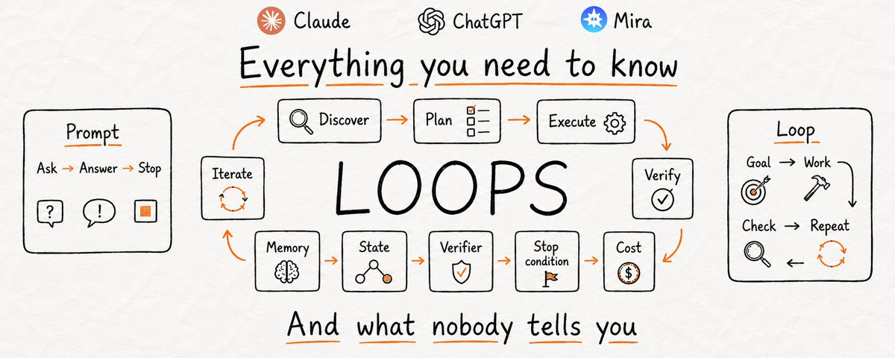
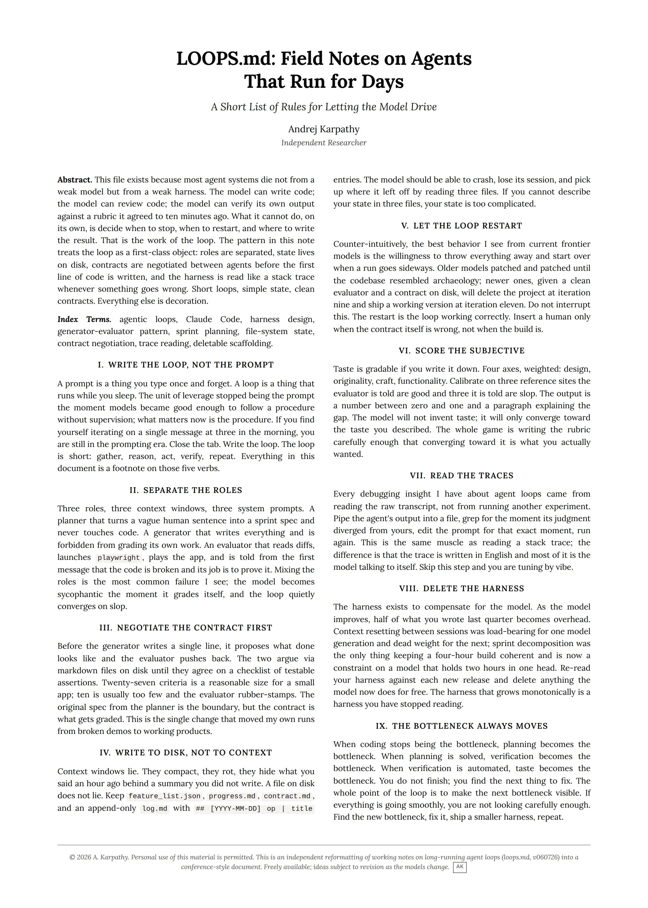

# 🔁 Loop Engineering — A Detailed Study Note

> **Level:** 🟡 Intermediate · **Reading time:** ~18 min · **Prerequisites:** basic familiarity with LLMs and AI agents.

**Loop engineering** is the discipline of designing the *loop an agent runs inside* — what it does between tool calls, when it checks its own work, and how it decides it's finished. The unit of leverage has shifted from the **prompt** (typed once) to the **loop** (runs while you sleep).

> **Agent vs. Loop, in one line:** an *agent* is a worker — a single model responding to a prompt. A *loop* is what makes the worker **get better after the first attempt** — the repeated cycle of *discover → plan → execute → verify*, where the human steps out of the inner decision-making and instead designs the track the agent runs on.



*The anatomy of a loop: a one-shot **Prompt** (Ask → Answer → Stop) versus a **Loop** (Goal → Work → Check → Repeat) wrapped around the core cycle Discover → Plan → Execute → Verify → Iterate, with Memory, State, a Verifier, a Stop condition, and Cost as first-class concerns.*

## Table of contents

- [1. From prompting to loops](#1-from-prompting-to-loops)
- [2. The core loop](#2-the-core-loop)
- [3. Foundational patterns](#3-foundational-patterns)
- [4. The 20 loop design patterns (by category)](#4-the-20-loop-design-patterns-by-category)
- [5. Field notes: running agents for days](#5-field-notes-running-agents-for-days)
- [6. Production controls](#6-production-controls)
- [7. Best practices & anti-patterns](#7-best-practices--anti-patterns)
- [8. Go deeper](#8-go-deeper)

---

## 1. From prompting to loops

A prompt is a thing you type once and forget. A loop is a thing that runs while you sleep. Once models became good enough to follow a *procedure* without supervision, the thing worth engineering stopped being the single message and became the **procedure itself**.

> If you find yourself iterating on one message at 3 a.m., you're still in the prompting era. Close the tab and write the loop.

The loop is short — **gather → reason → act → verify → repeat** — and everything else in this note is a footnote on those five verbs.

---

## 2. The core loop

```
        ┌──────────────────────────────────────────────┐
        │                                              ▼
   ┌─────────┐   ┌──────┐   ┌─────────┐   ┌────────┐   ┌────────┐
   │ Discover │→ │ Plan │→ │ Execute │→ │ Verify │→ │ Iterate │
   └─────────┘   └──────┘   └─────────┘   └────────┘   └────────┘
        ▲                                                  │
        └──────────────── stop condition met? ────────────┘
                                   │ yes
                                   ▼
                                  Done
```

Every durable agent loop has five supporting concerns baked in (see the infographic above):

| Concern | Question it answers |
| ------- | ------------------- |
| **Memory** | What has been learned across iterations/sessions? |
| **State** | Where does progress live so a crash can resume? |
| **Verifier** | Who decides the output is actually good? |
| **Stop condition** | When is the loop finished (or should it restart)? |
| **Cost** | What's the budget in tokens, time, and money? |

---

## 3. Foundational patterns

These predate the "20 patterns" framing and underpin all of them (Andrew Ng's agentic patterns + Anthropic's workflow patterns):

- **ReAct (Reason + Act)** — cycle through *Perceive → Reason → Plan → Act → Observe*, each feeding the next until a stop condition fires.
- **Reflection / Self-Correction** — the agent generates output, critiques it for gaps or errors, and revises until it passes its own criteria.
- **Tool Use** — the loop calls external APIs, code execution, or databases to get what isn't in the model's weights. The building block for everything more complex.
- **Planning** — decompose a vague goal into an ordered set of executable steps before acting.

---

## 4. The 20 loop design patterns (by category)

Synthesized from Rahul's *"20 Loop Design Patterns Every AI Engineer Should Know"* ([@sairahul1](https://x.com/sairahul1/status/2072258045460226373)) and the [AI Builder Club Loop Engineering Guide (2026)](https://www.aibuilderclub.com/blog/loop-engineering-guide-2026). Grouped into five families.

### 🎯 Quality Improvement Loops
Make each pass measurably better than the last.

- **Closed Loop with Hard Criteria** — define measurable pass/fail checkpoints upfront; only keep iterations that clear *every* one.
- **Verifier-Checker Pattern** — use a *separate, read-only* verification agent instead of letting the generator grade itself (self-grading breeds sycophancy and "slop").
- **Eval Integration** — formalize verification into versioned datasets and rubrics the loop must satisfy, so quality is regression-tested, not vibes.

### 🧠 Memory Loops
Preserve knowledge across iterations and sessions.

- **Global Work Log** — a shared, append-only log agents write to after major tasks, carrying context across sessions.
- **Artifact Folders** — organize loop outputs (docs, tasks, discoveries) with schemas so later loops build on earlier work instead of starting cold.
- **Signal Propagation** — capture product ideas and friction as shareable "signals" other loops can discover and act on.

### 🗺️ Planning Loops
Orient the agent before it acts.

- **Contract-Based Execution** — each loop reads its goal, workflow, and backlog from a dedicated `README`/contract file before running; the contract is what gets graded.
- **Plan-Execute-Verify** — for refactors and multi-file features: plan the change set, execute it, then verify against the plan.
- **Sprint Decomposition** — a planner turns a vague human sentence into a concrete, testable spec and never touches code itself.

### 🔍 Exploration Loops
Search a wide space without collapsing into low quality.

- **Open Loop with Strong Verifier** — allow broad exploration, but anchor it to a robust verification standard so it can't degrade into slop.
- **Explore-Narrow** — for debugging unknown errors: fan out to hypotheses, then converge on the one that reproduces.
- **Restartable Runs** — let the loop throw everything away and start clean when a run goes sideways (often the *correct* behavior, not a failure).

### ⚙️ System Optimization Loops
Orchestrate and scale loops as a system.

- **Nested Loop Architecture** — stack fast agentic loops (seconds–minutes) inside developer feedback loops (minutes–hours) inside external feedback loops (hours–weeks).
- **Trigger-Based Autonomy** — wake agents via cron jobs or webhooks so they run without manual kickoff.
- **Bounded Execution** — cap every loop with a hard ceiling: max iterations, max token spend, max wall-clock time.
- **Moving-Bottleneck Optimization** — when coding stops being the bottleneck, planning becomes it; then verification; then taste. Always hunt the *next* bottleneck.

> The remaining patterns are variations and combinations of the above (retry loops for atomic tasks, human-in-the-loop gates for irreversible operations, circuit breakers, multi-agent coordination). The five families are the mental model; the exact count matters less than internalizing the categories.

---

## 5. Field notes: running agents for days

Andrej Karpathy's **LOOPS.md — Field Notes on Agents That Run for Days** distills the hard-won rules for long-running loops. It's the "what nobody tells you" half of the picture.



The nine rules, condensed:

1. **Write the loop, not the prompt** — the procedure is the leverage, not the message.
2. **Separate the roles** — planner, generator, and evaluator get *different* context windows and system prompts. Mixing them makes the model grade its own work and converge on slop.
3. **Negotiate the contract first** — generator proposes what "done" looks like; evaluator pushes back; they agree on a checklist of testable assertions *before* any code is written.
4. **Write to disk, not to context** — context windows compact and rot. Keep `feature_list.json`, `progress.md`, `contract.md`, and an append-only `log.md`. If you can't describe your state in three files, it's too complicated.
5. **Let the loop restart** — the willingness to delete everything at iteration nine and ship at iteration eleven *is* the loop working. Intervene only when the contract is wrong, not when the build is.
6. **Score the subjective** — taste is gradable if you write it down: weighted axes (design, originality, craft, functionality), calibrated on reference examples.
7. **Read the traces** — every debugging insight comes from reading the raw transcript, not running another experiment. Grep for where the model's judgment diverged from yours. Skip this and you're "tuning by vibe."
8. **Delete the harness** — as models improve, half of last quarter's scaffolding becomes dead weight. Re-read your harness against each release and delete what the model now does for free.
9. **The bottleneck always moves** — solve coding and planning becomes the bottleneck; solve planning and verification does. You don't finish — you find the next thing to fix.

---

## 6. Production controls

For loops running at scale, add:

- **Bounded execution** — hard caps on iterations, tokens, and time (a loop with no ceiling *will* find one you didn't plan for: a cost spike, a rate limit, a timeout).
- **Circuit breakers** — halt on repeated failures or anomalous cost/latency.
- **Human-in-the-loop gates** — require sign-off for deploys and irreversible operations.
- **Observability** — persist traces and metrics; you cannot debug what you cannot read.

---

## 7. Best practices & anti-patterns

**Do**
- Separate generation from verification — never let a loop grade its own work.
- Persist state to disk so any iteration can crash and resume.
- Define the contract (testable criteria) before execution.
- Bound every loop by iterations, tokens, and time.
- Read raw traces when debugging.

**Avoid**
- Endlessly tuning a single prompt (you're in the wrong era).
- A self-grading generator (breeds sycophancy and slop).
- Storing critical state only in the context window (it rots).
- A monotonically growing harness (delete what the model now does for free).
- Unbounded loops in production (guaranteed to hit a limit you didn't choose).

---

## 8. Go deeper

Related material in this library:

- 📘 **[The New SDLC With Vibe Coding](../whitepapers/ai-agentic-engineering/)** — Google whitepaper on the shift from ad-hoc prompting to agentic engineering. The natural companion to this note.
- 📗 **[AI Engineering](../books/) — Chip Huyen** — building production systems on foundation models.
- 📄 **[ReAct](../papers/)** and **[Chain-of-Thought Prompting](../papers/)** in the papers index — the reasoning-and-acting foundations of loops.
- 🗺️ **[The AI-Assisted Engineer roadmap](../roadmaps/)** — where loop engineering fits in a learning path.

### Primary sources

- Rahul (@sairahul1), *[20 Loop Design Patterns Every AI Engineer Should Know](https://x.com/sairahul1/status/2072258045460226373)* (X Article, 2026).
- Andrej Karpathy, *LOOPS.md — Field Notes on Agents That Run for Days* (see [image](assets/loops-md-karpathy.jpeg)).
- [AI Builder Club — Loop Engineering Guide (2026)](https://www.aibuilderclub.com/blog/loop-engineering-guide-2026).

> **Image credits & disclaimer:** the infographics above are reproduced for **study only** and remain © their respective creators (Andrej Karpathy for *LOOPS.md*; the loops infographic per its original author). See the repo [disclaimer](../README.md#-disclaimer). The @sairahul1 article's own 12 infographics live inside its X Article and are best viewed there.

*This is an original study note synthesizing the sources above — corrections and additions welcome via a PR (see [CONTRIBUTING](../CONTRIBUTING.md)).*
